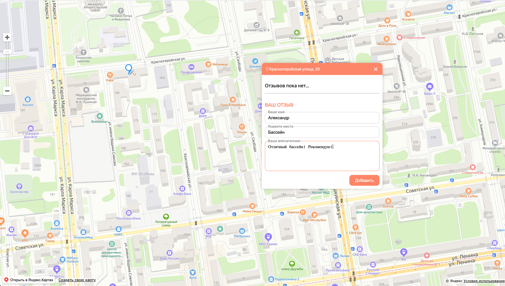

# Гео-отзывы

Учбеное приложение, разработанное на курсе Loftschool "Комлексное обучение JavaScript"

## Описание

Приложение основано на API Яндекс.Карт. Приложение позволяет оставлять метки с отзывами на карте. Отзывы хранятся в LocalStorage.

## Установка

Установить зависимости:
##### `npm install`

Старт проекта
##### `npm start`

